## Proiect testare 1
  <!-- TOC -->
[Despre Docker](#despre-docker) \
[Exemple comenzi](#exemple-de-comenzi-docker) \
[Rulare comenzi](#rulare-comenzi-docker)
<!-- TOC -->
### Despre Docker
  Docker este o platformă open-source care permite dezvoltatorilor să creeze, să distribuie și să ruleze aplicații în
  containere – unități izolate care includ toate dependențele necesare pentru funcționare. Spre deosebire de mașinile
  virtuale, containerele Docker sunt mai rapide, mai ușoare și rulează direct pe sistemul de operare al gazdei, folosind
  resurse minime.
  Cu Docker, aplicațiile pot fi portabile și consistente, indiferent de mediul în care sunt rulate – dezvoltare, testare
  sau producție. Aceasta face din Docker o alegere ideală pentru DevOps, microservicii și scalabilitate.

* Modalitati de accesare 
  * Local prin instalarea aplicatie de pe https://www.docker.com/products/docker-desktop/ sau prin metode de scripting
  prin brew pentru mac chocolately pentru powershell sau intslare de pachete pentru linux
  * Cloud la https://training.play-with-docker.com/ops-s1-hello/ 

### Exemple de comenzi docker
* **Comenzi utile system**
    * pentru afisarea versiunii SO din varianta docker cloud putem rula:
        *  cat /etc/os-release ce are ca output
          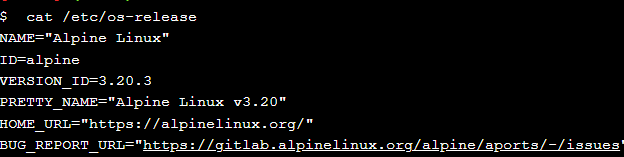
        * uname -s ce are ca rezultat
          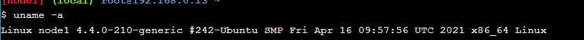

    * comenzi generale de docker
      *  docker -v pentru aflarea versiunii de docker
        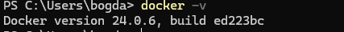
      * pentru listingul de argumente pentru docker docker --help
        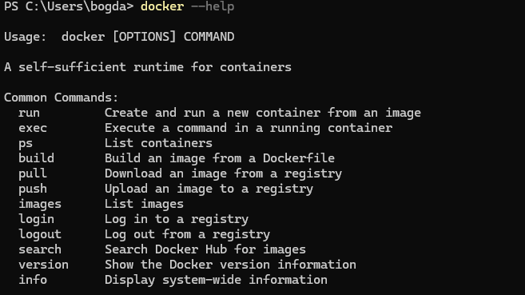

### RULARE COMENZI DOCKER
* **RULARE DOCKER**
    * Rulare imagine de docker hello-world varianta cloud
        * se aduce imaginea cu docker pull hello-world
          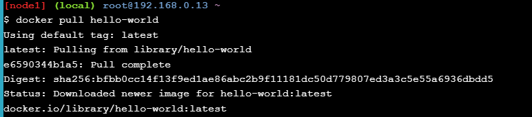
        * se listeaza imaginile cu docker image ls
          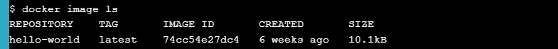
        * se executa imaginea docker run hello-world (numele imaginii)
          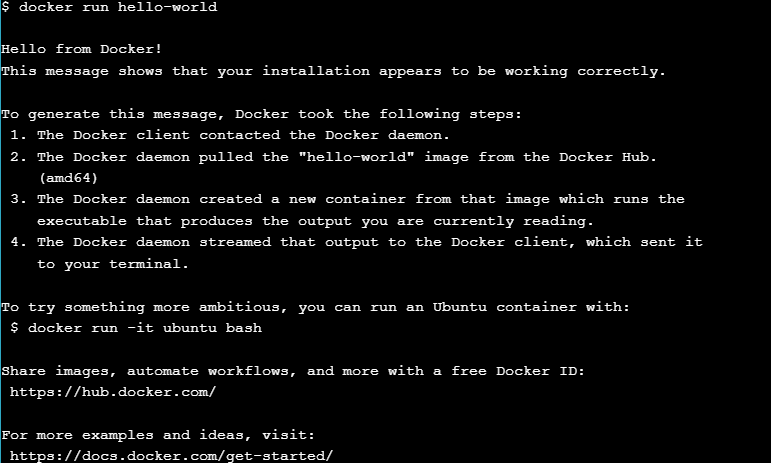
    * Rulare imagine de docker hello-world varianta desktop
        * se aduce imaginea cu docker pull hello-world
          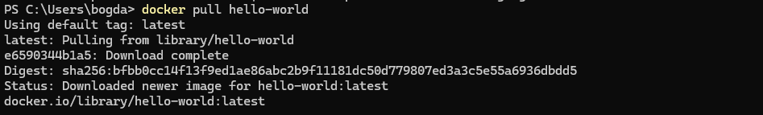
        * se listeaza imaginile cu docker image ls
          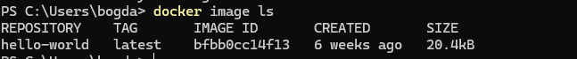
        * se executa imaginea docker run hello-world (numele imaginii)
          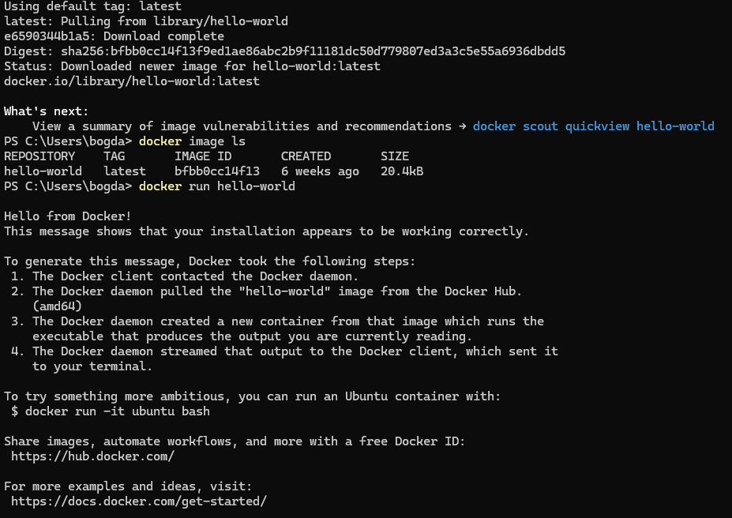
    
    * Rulare imagine si executie figlet pe windows
        * comenzi (docker pull hairyhenderson/figlet,  docker image ls, docker run hairyhenderson/figlet Butoi Bogdan Ionut)
          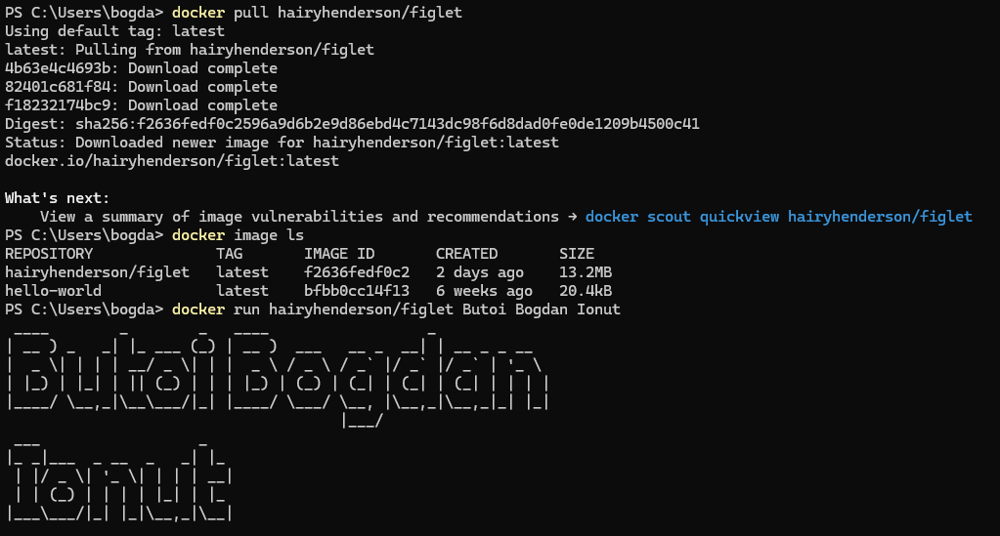 

    * Rulare docker din python varianta figlet

    ```python
       import docker
       
       # Initialize Docker client
       client = docker.from_env()
       
       output = client.containers.run("hairyhenderson/figlet", "salut UTM 2024", remove=True)
       
       output = output.decode("utf-8")
       
       print(output)
    ```   
    * Rulare docker din python hello-world

    ```python
      import docker

      client = docker.from_env()
      container = client.containers.run("hello-world")
      print(container.decode(" utf-8"))
    ```
    * Rulare docker prin Dockerfile
        Se genereaza un fisier Dockerfile al carui continut rulat de catre Docker
        comanda de build a imaginii de docker este **docker build -t xxx -f yyyy**
        unde xxx reprezinta numele imaginii ce va fi generata iar yyy reprezinta calea inclusiv
        numele fiserului Dockerfile
      * Afisarea unui text in terminal
        Descrierea continutului
        ```dockerfile
        FROM alpine:latest

        CMD ["echo", " WELCOME BUTOI BOGDAN"]
        ```
        From alpine:latest reprezinta ultima versiune a imaginii de linux alpine
        CMD executa o comanda de linux
        Pentru a rula imaginea build-uita se foloseste comanda **docker run xxx**
      * Afisare textului hello docker/podman world Butoi Bogdan in browser la adresa localhost:50205
          ```dockerfile
            FROM nginx:latest
            
            WORKDIR /usr/share/nginx/html
            
            COPY index.html index.html
            
            EXPOSE 80
            
            CMD ["nginx", "-g", "daemon off;"]
          ```
        Descriere continutului
        FROM nginx:latest aduce ultima imagine de nginx
        WORKDIR /usr/share/nginx/html seteaza calea de randare a fisierelor html
        COPY index.html index.html copiaza continutul local al fisierului index.html
        in index.html din /usr/share/nginx/html (WORKDIR)
        EXPOSE 80 deschide portul 80 de pe container
        CMD ["nginx", "-g", "daemon off;"] porneste serviciul de nginx
        Pentru build se pot folosi comenzile de mai sus insa pentru run
        folosim **docker run -d -p 5205:80 my-ngin**x unde my-nginx reprezinta numele containerului
        -d ruleaza in mod detached (executa si inchide cli-ul) -p 50205:80 mapeaza portul 80 de pe container
        cu portul 5205 de pe statia de lucru
      
        
