REFERAT Eiffel

fiabilitatea si testarea aplicatiilor software

Cuprins
  - [Eiffel](#eiffel)
  - [Introducere](#introducere)
  - [Procesul practic](#procesul-practic)
  - [Intrebari](#intrebari)

# Eiffel

## Introducere

Eiffel este un limbaj de programare orientat spre obiecte creat de Bertrand Meyer la inceputul anilor '80. Acesta este un limbaj puternic tipat si cu un sistem de verificare statica a tipurilor, ceea ce ajuta la crearea de aplicatii fiabile si robuste. Eiffel are o sintaxa simpla si clara, care faciliteaza scrierea si citirea codului, si este folosit in diverse domenii, inclusiv programarea aplicatiilor de afaceri, dezvoltarea de software incorporat si proiectarea sistemelor complexe.Eiffel este un limbaj de programare orientat spre obiecte, dezvoltat de Bertrand Meyer la începutul anilor '80. Acest limbaj se caracterizează prin tiparea puternică și verificarea statică a tipurilor, facilitând astfel crearea de aplicații fiabile și robuste. Sintaxa sa simplă și clară permite scrierea și citirea ușoară a codului, fiind utilizat în diverse domenii, inclusiv în programarea aplicațiilor de afaceri, dezvoltarea de software încorporat și proiectarea sistemelor complexe.

EiffelStudio este un mediu de dezvoltare integrat (IDE) pentru limbajul Eiffel, oferind un set de instrumente și funcționalități pentru programarea orientată spre obiecte. Acesta este folosit pentru dezvoltarea de aplicații software complexe și fiabile.

EiffelStudio este un mediu de dezvoltare integrat (IDE) pentru limbajul de programare Eiffel. Acesta oferă un set de instrumente și funcționalități pentru programarea orientată spre obiecte și este utilizat pentru dezvoltarea de aplicații software complexe și fiabile.

## Procesul practic

Eiffel poate fi rulat printr-un client specializat in acest sens sau direct din browser.

**Eiffel rulat prin interfata grafica EiffelStudio**

1. **Create Project**
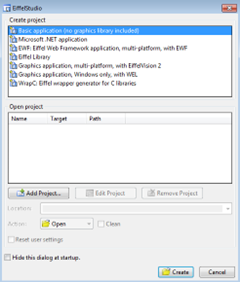
Utilizatorii pot specifica numele si locatia proiectului, precum si sa selecteze configurarea dorita pentru proiectul lor.

Se selecteaza tipul **Basic Application**.

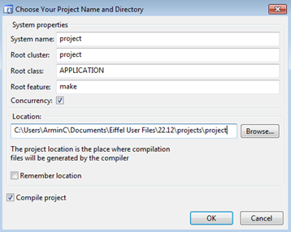
Sunt definite detaliile proiectului, inclusiv **calea directorului**.

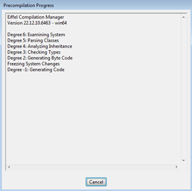
Se va institui **precompilarea librariilor**, ce reprezinta crearea unei biblioteci de cod pre-compilata care poate fi inclusa in alte proiecte pentru a reduce timpul de compilare si a imparti codul intre mai multe proiecte Eiffel.

1. **Rulare cod**

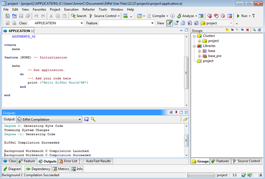
Se va **compila** si **rula** codul sursa.

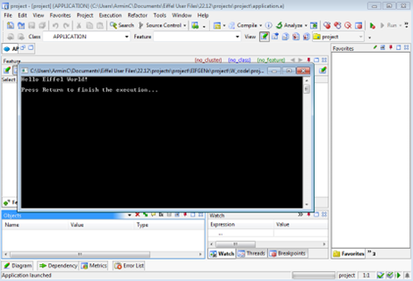

1. **Project documentation**

Documentatia este o documentatie a codului sursa al unui proiect, care poate fi generata automat. Poate include informatii despre clase si metode, precum si exemple si explicatii pentru a ajuta la intelegerea codului sursa si utilizarea sa in alte proiecte.

Se acceseaza functia prin **Project** > **Generate Documentation**.

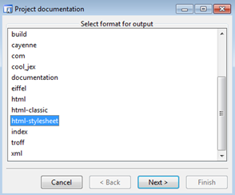

Este selectat formatul **html-stylesheet**.

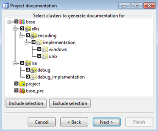

Se selecteaza **clasele** si **modulele** carora li se va genera documentatia.

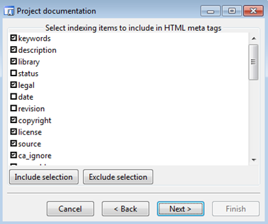

Optiunile selectabile de includere **etichete meta HTML**.

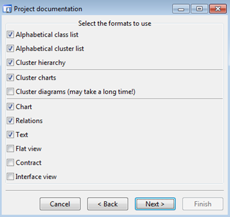

Alegerea **formatelor** folosite in documentatie.

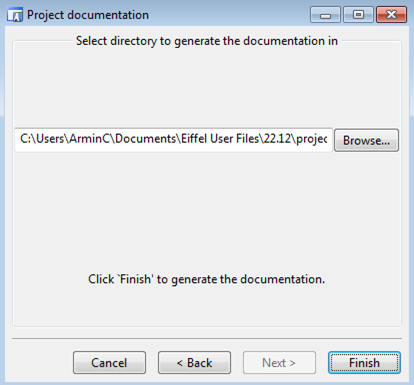

Selectarea **directorului destinatie** in care se vor genera fisierele documentatiei.

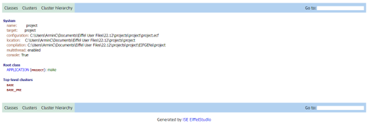

Documentatia generata este afisata.

1. **Testare**

Utilizatorii pot defini diverse teste unitare pentru a verifica functionalitatea claselor si metodelor din proiectul Eiffel si pot rula aceste teste automat folosind AutoTest. Aceasta caracteristica poate ajuta la identificarea erorilor si defectelor de cod intr-un mod mai rapid si mai eficient decat testarea manuala. Rezultatele testelor sunt afisate in interfata utilizatorului si pot fi utilizate pentru a imbunatati calitatea codului.

Se acceseaza functia prin **View** > **Tools** \> **AutoTest** > **Create new test** – Create manual test.

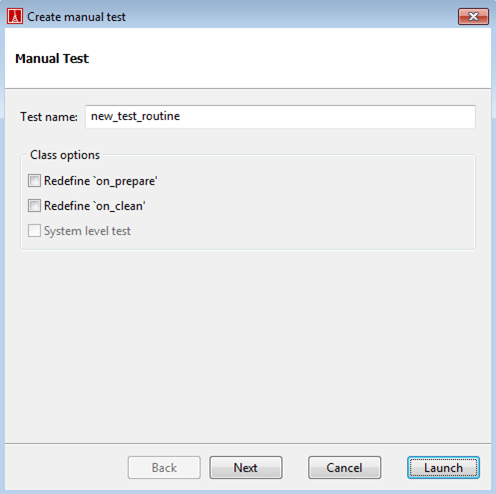

Se defineste numele testului.

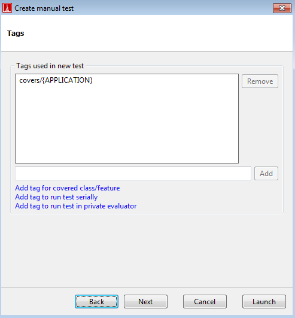

**Etichetele** sunt cuvinte cheie asociate unui test manual pentru a-i descrie continutul si pentru a ajuta la organizarea testelor. Ele pot fi utilizate pentru a grupa teste care testeaza anumite functionalitati sau caracteristici ale aplicatiei.

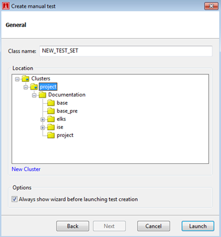

Testul creat este rulat in zona panoului **AutoTest** \> **Run**.

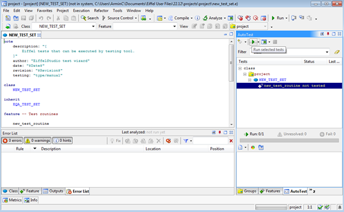
Testul a fost alterat si rulat. Rezultatul este **PASSED**.

1. **Metrics**

Metrics reprezinta informatiile numerice colectate din codul sursa al unui program, cum ar fi numarul de linii de cod, numarul de clase, numarul de metode, complexitatea ciclomatica, numarul de erori si avertismente, acoperirea testelor si altele. Aceste informatii pot fi utilizate pentru a evalua calitatea si performanta codului, precum si pentru a identifica zonele care necesita imbunatatiri sau optimizari.

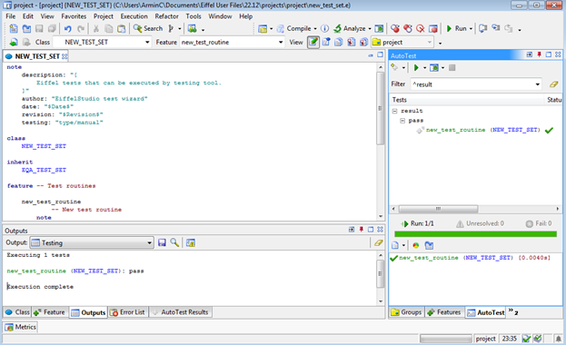
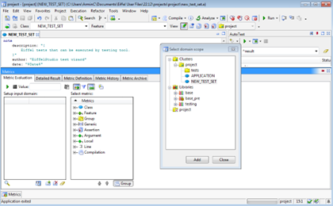
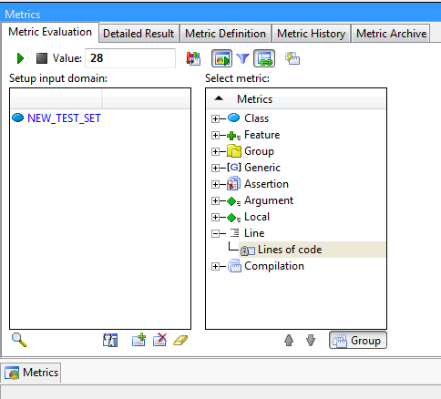

Se afiseaza rezultatul rularii metricii **LOC**.

1. **Diagrams**

Diagramele sunt reprezentarea grafica a relatiilor si dependentelor intre obiecte intr-un sistem software, care poate fi utilizata pentru a vizualiza si a intelege mai bine structura sistemului. Exista mai multe tipuri de diagrame, cum ar fi diagramele de clasa, diagramele de pachete, diagramele de secventa, diagramele de stari si altele.

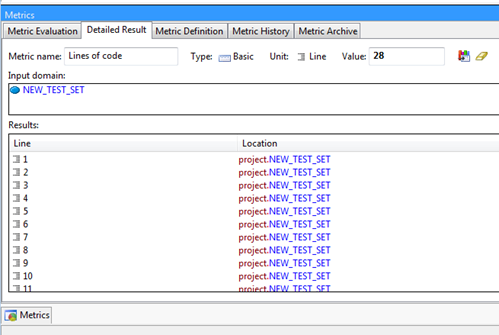
Afisare diagrama cu **stramosi** si **mostenitori**:

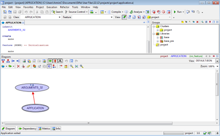

## Intrebari

**1\.** Cum poate fi utilizata Eiffel in dezvoltarea de aplicatii web?

EiffelStudio include un framework web numit EiffelWeb, care ofera suport pentru dezvoltarea aplicatiilor web. Acesta include un server HTTP si un API pentru crearea de pagini web dinamice.

**2\.** Care este principala caracteristica a limbajului Eiffel?

Se remarca securitatea tipurilor si verificarea statica a tipurilor, care ajuta la evitarea erorilor de programare.

**3.** Cum este implementata functionalitatea de "construire in timp real" in aplicatia Eiffel?

Pentru a permite construirea in timp real, Eiffel utilizeaza tehnologii precum compilare incrementala si livrare continua. Acestea permit dezvoltatorilor sa construiasca si sa testeze codul in timp real, fara a fi nevoie sa astepte pana cand intreaga aplicatie este finalizata.