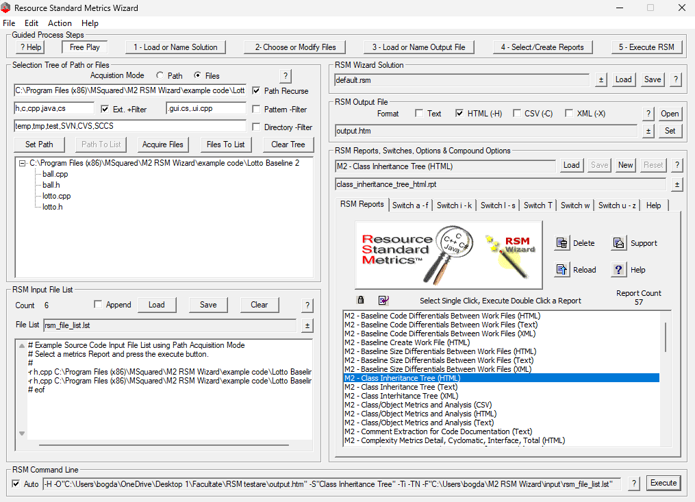
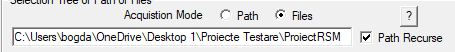
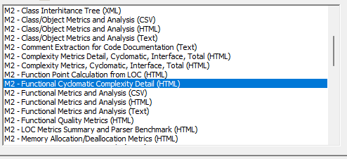

## Proiect testare RSM

<!-- TOC -->
  * [Proiect testare RSM](#proiect-testare-rsm)
    * [Despre RSM](#despre-rsm)
    * [Exemple de rulare RSM](#exemple-de-rulare-rsm)
<!-- TOC -->

### Despre RSM

Resource Standard Metrics (RSM) este un instrument de analiză software dezvoltat de M Squared Technologies. Acesta este
conceput pentru a măsura și analiza complexitatea, calitatea și mentenabilitatea codului software. RSM oferă metrici și
rapoarte detaliate care ajută dezvoltatorii și managerii de proiect să înțeleagă structura și performanța codului lor.
Suportă multiple limbaje de programare și se integrează cu diverse medii de dezvoltare, făcându-l un instrument versatil
pentru îmbunătățirea proceselor de dezvoltare software.
Acesta poate testa fisiere de tip C, C++, C# si JAVA

* Modalitati de accesare
    * Local prin instalarea aplicatie de pe http://msquaredtechnologies.com sau prin metode de scripting

### Exemple de rulare RSM
* Interfată grafică
  * Pentru a rula interfața grafică a RSM, se deschide fișierul RSM.exe din directorul de instalare.
  
  * Se selectează calea catre fișierele sursă
    
    Daca se doreste analiza unui proiect intreg, se bifeaza path
    Din lista se selecteaza modalitatea de testare in cazul nostru complexitatea cyclomatica
    
    Se apasă butonul "Execute" pentru a începe analiza
    Se genereaza un raport HTML in cazul nostru pentru ca acest tip de raport a fost selectat
    Daca vrem sa porsonalizam raportul ediatam fisierul rsm.cfg din directorul de instalare
    Raportul generat este atasat in fisierul [Raport](output.htm)