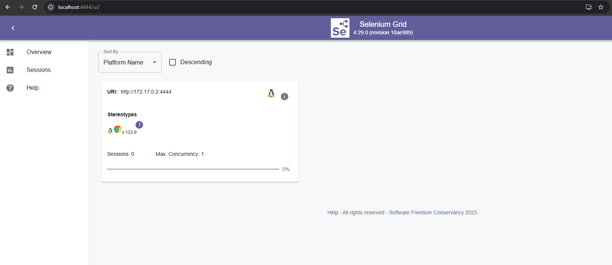
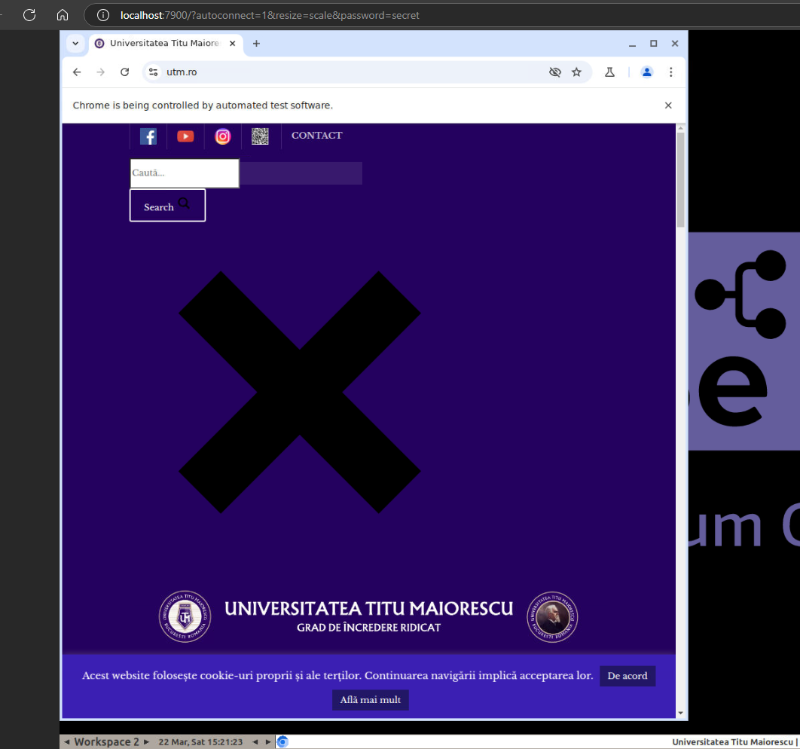
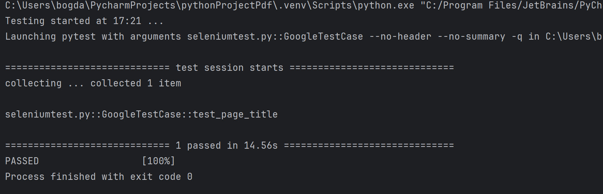
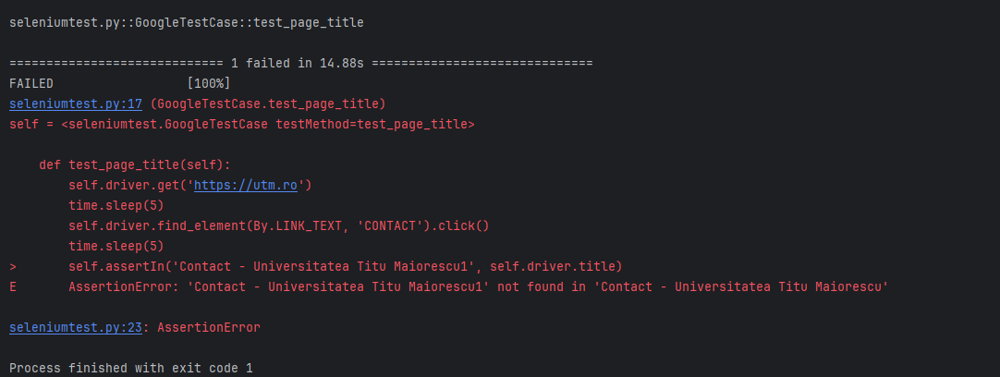

## Proiect testare Selenium
<!-- TOC -->
[Despre Selenium](#despre-selenium) \
[Exemple comenzi](#exemple-de-comenzi-selenium) \
[Rulare comenzi](#rulare-comenzi-selenium)
<!-- TOC -->

### Despre Selenium
Selenium este un framework open-source pentru automatizarea testelor de aplicații web. Acesta oferă un set de instrumente pentru a scrie teste automate în diverse limbaje de programare, inclusiv Java, Python, Ruby, C#, PHP și JavaScript. Selenium permite testarea interacțiunilor utilizatorului cu aplicația web, cum ar fi completarea de formulare, navigarea între pagini și verificarea conținutului. Acesta poate fi folosit pentru testarea funcționalității, performanței și securității aplicațiilor web, precum și pentru integrarea cu alte instrumente de testare și de gestionare a ciclului de viață al aplicațiilor.

* Modalitati de accesare 
    * Local prin instalarea Selenium WebDriver de pe https://www.selenium.dev/downloads/ sau prin metode de scripting
    * Docker SELENIUM SERVER la https://hub.docker.com/u/selenium
    * Cloud la https://www.browserstack.com/guide/selenium-grid-tutorial

### Exemple de comenzi Selenium
* Rulare prin Docker SELENIUM SERVER
  ```dockerfile
    docker pull selenium/standalone-chromium:latest
    sau prin Dockerfile 
    FROM selenium/standalone-chromium:latest
    
    docker run -d -p 4444:4444 -p 7900:7900 --shm-size="2g" selenium/standalone-chromium:latest

  ```
  Duceti testele WebDriver către http://localhost:4444 prin API-ul Selenium sau prin orice client WebDriver.
  Pentru a vedea ce se întâmplă în interiorul containerului, accesați
  **http://localhost:7900/?autoconnect=1&resize=scale&password=secret**
  Captura ecran cu aplicatia selenium standalone chromium
  
  
  * Testare Selenium prin python
    Se instaleaza pip install -U selenium
    ```python
        import unittest
        from selenium import webdriver
        import time
        from selenium.webdriver.common.by import By
        
        
        class GoogleTestCase(unittest.TestCase):
            options = webdriver.ChromeOptions()
        
            driver = webdriver.Remote(
                command_executor='http://localhost:4444/wd/hub',
                options=options
            )
        
            def setUp(self):
                self.addCleanup(self.driver.quit)
        
            def test_page_title(self):
                self.driver.get('https://utm.ro')
                time.sleep(5)
                self.driver.find_element(By.LINK_TEXT, 'CONTACT').click()
                time.sleep(5)
                self.assertIn('Contact - Universitatea Titu Maiorescu', self.driver.title)
        
            
            if __name__ == '__main__':
            unittest.main(verbosity=2)
    ```

    Captura ecran cu aplicatia python prin rulare pe serverul de selenium
    
    La finalul executiei testului se va afisa rezultatul testului
    Testul acceseaza pagina de contact a site-ului https://utm.ro si verifica daca titlul paginii este "Contact - Universitatea Titu Maiorescu"
    
    Daca vrem sa reproducem o eroare modificam ceva in test, de exemplu in loc de "Contact - Universitatea Titu Maiorescu" punem "Contact - Universitatea Titu Maiorescu1"
    Eroarea va fi afisata in urma rularii testului
    